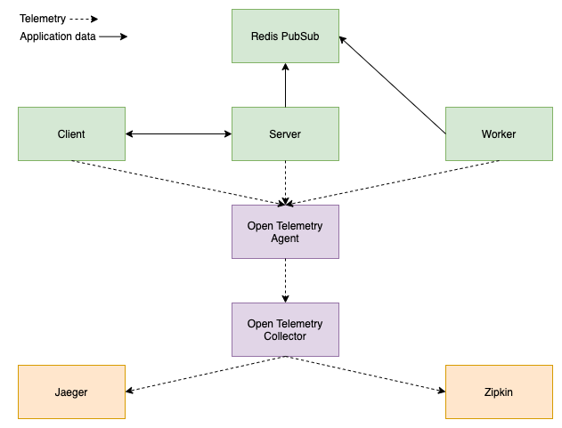
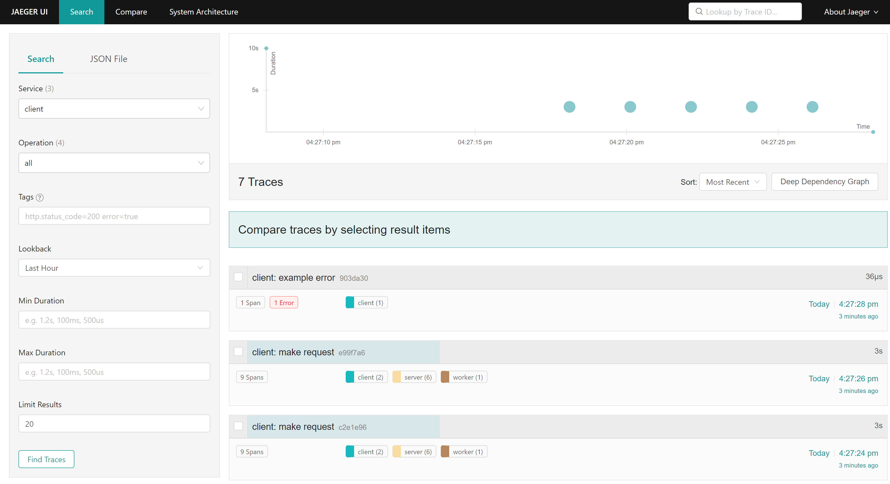
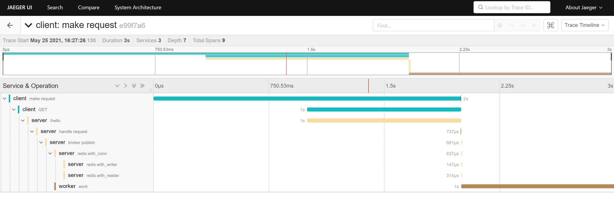

# What is this?
This is a demo of Open Telemetry's distributed tracing capabilities, using
a dummy application described by this architecture diagram:

> Note: The solid arrows describe how the services send all non-telemetry data
  to each other (for instance, http requests). The dotted arrows describes the
  flow of all telemetry data (traces).

These depicted services can be found in `docker-compose.yml`:
* `client` - A service that sends a few requests to the server.
* `server` - A service that implements an HTTP server and publishes a message
  per request via [redis' pubsub](https://redis.io/topics/pubsub).
* `worker` - A service that listens for messages on redis' pubsub and
  does work when a message is published.
* `redis` - An open source key value store that is used for its
  lightweight pubsub message broker capabilities.
* `jaeger` - An open source telemetry backend.
* `zipkin` - An open source telemetry backend.
* `otel-agent` - A service that receives traces from `server`, `client`, and `worker`.
  In a real deployment, each service is expected to run an agent locally
  that forwards telemetry data to the collector. It handles logic such as 
  retries and batching, so you don't have to implement that in your code. It
  can also enhance telemetry with additional metadata. The agent is actually
  a local version of the collector.
* `otel-collector` - A service that receives traces forwarded from `otel-agent`
  and exports them to `jaeger` and `zipkin`. In a real deployment, this could
  be running on another VM or scaled horizontally as a cluster behind a load
  balancer, depending on desirable uptime.

# Why is this interesting?
1. By using Open Telemetry with the collector, backends are swappable *without
   having to redeploy your application or add any specific code about a
   particular backend to your application* and all services handle tracing in
   the same way, regardless of programming language.

   Specifically, applications send traces to the agent, which forwards them to
   the collector, and the collector defines backends via exporters in yaml. To
   swap backends, just change the configuration in yaml and redeploy the
   collector without touching application code.

   Here we use 2 exporters, `jaeger` and `zipkin`, but there are many possible
   exporters including
   [Azure Monitor](https://github.com/open-telemetry/opentelemetry-collector-contrib/tree/main/exporter/azuremonitorexporter).

2. Cloud architectures often use some form of a message broker to communicate
   long running operations. While HTTP is covered via docs, many messaging
   systems use protocols that are not automaticcaly supported by the
   Open Telemetry SDK (trace contexts are not injected and extracted for you
   automatically, you must manually do so yourself).
   One such example would be redis' pubsub wire protocol. In this repo, we show
   how to add distributed tracing to any arbitrary messaging system.

3. Many popular libraries integrate with Open Telemetry with no extra work
   required. One library is [go-redis](https://github.com/go-redis/redis). This
   is great because if a library is not instrumented, the best you can do is
   either modify the library or instrument code which calls the library (which
   inherently misses internal events in the library that do not bubble up to
   the surface of the exposed API).

# How to use?
`docker-compose up --build` brings up all services. 

The `client` sends a few requests to `server`. The `server` publishes messages
to `redis`. The `worker` listens for messages and performs work when they are
published.

The distributed traces appear in `jaeger` and `zipkin`.

`jaeger` can be accessed at `http://localhost:16686`.

`zipkin` can be accessed at `http://localhost:9411`.

`docker-compose down` cleans up all resources.

If you would like to manually make requests to the server after the client ends,
navigate to `http://localhost:8080/hello`.

After requests have been made, if you choose the `client` service in `jaeger`,
you should see something similar to:

Note that you can see all traces that started from the client. If you click on
a trace, you can see the distributed spans that make up the trace:

# Advice for running in production
## Do I *really* need agents/collectors?
In my opinion, the answer is almost always no. Here are cases where I believe
they are needed:
  1. You would like to change the telemetry backend without redeploying your
     application.
  2. You would like to limit your points of egress. With the collector,
     the only time where a network request would be made to a third party
     would be when the collector sends traces to commercial backend,
     such as Data Dog.

Keep in mind the added complexity of using agents/collectors.

Deploying an agent alongside every service introduces more configuration and
requires more compute. It also increases the surface area for bugs.
What if something goes wrong in the agent? If it is deployed as a sidecar,
how would it affect the main service?

Managing a collector in a large application may actually mean managing a
cluster of collectors behind a load balancer. This comes with the typical
headaches of managing any cluster, including extra responsibility and cost.

## How can I use Open Telemetry without agents/collectors?
There are exporters for the collector as well as exporter libraries for
your application code that do not require the collector. However, if you use an
exporter library in your application code, then that configuration will need to
exist in all your services and you cannot change that configuration without
redeploying your service.

If this tradeoff works for you, search for an exporter library in
[the official registry](https://opentelemetry.io/registry/).

For instance, when searching for "Azure Monitor" one of the first results
links to
[Azure Monitor exporter for python](https://github.com/microsoft/opentelemetry-azure-monitor-python).

If our demo were written in python, to use the library, you would replace code
for initializing the tracer in `pkg/tracer` with the Azure Monitor exporter. At
this point, you would no longer need agents or collectors. While initializing
the tracer requires changes, the actual usage of the tracer thereafter will not
change at all.

With serverless, this can be especially useful because it is often harder
to deploy agents and collectors.

# How to navigate the code?
Start by reading the comments in `cmd/client/client.go`.
They describe how to create a trace that propagates to the server via
an HTTP request.

Next, read the comments in `cmd/server/server.go`. They describe
how the propagated trace is used in children spans.

Next, read the comments in `pkg/message.go`. They describe how to
add headers to the message that propagate the trace context from the `server`
to the `worker`, in the same way as would be done via HTTP.

Next, read the comments in `cmd/worker/worker.go`. They describe how to
extract the trace context from messages on redis' pubsub and create child spans
with this context.

Next, read the comments in `pkg/broker.go`. They describe how the trace context
can be manually injected and extracted, when publishing and receiving messages.

Finally, read the comments in `pkg/tracer.go`. They describe boilerplate code
that sets up a tracer provider for each application.

# Development
A dev container has been provided. To use:
* Ensure the `Remote - Containers` extension is installed in VSCode
* Open the project in the container
* Install the Go extension libraries with `Go: Install/Update tools` from
  the command palette

> Note: When running any docker commands, run them from outside of the
dev container (on the host machine)

# Citations
The collector code is adapted from
[this official otel example](https://github.com/open-telemetry/opentelemetry-collector/tree/main/examples/demo).

The client / server code is adapted from 
[this official otel example](https://github.com/open-telemetry/opentelemetry-go-contrib/tree/main/instrumentation/net/http/otelhttp/example).
